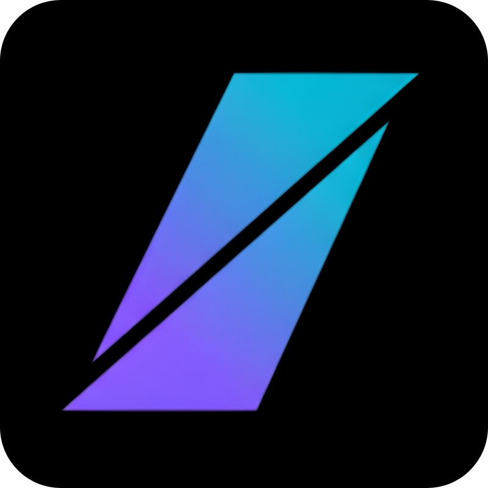
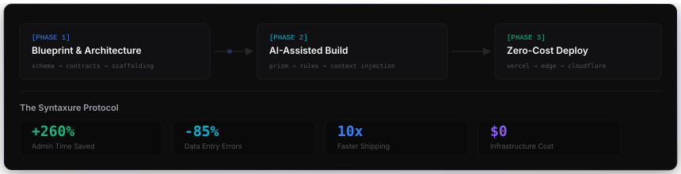
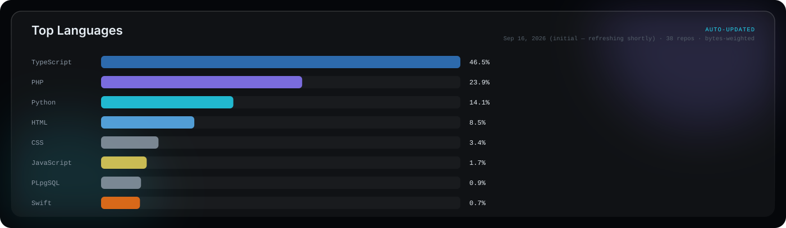

<picture>
  <source media="(prefers-color-scheme: light)" srcset="assets/hero-banner.svg">
  
</picture>

 

<picture>
  <source media="(prefers-color-scheme: light)" srcset="assets/terminal-about.svg">
  
</picture>

## Achievements

<picture>
  <source media="(prefers-color-scheme: light)" srcset="assets/achievements.svg">
  
</picture>

<b>Achievement detail &amp; source notes</b>

 

| Recognition | Result | Context |
|---|---|---|
| **CodersRank** | Top 1% worldwide · #1 Iloilo · Top 15 Philippines | Live developer skill ranking |
| **INESCOM 2025** (Indonesia) | 🏆 Best Poster + 🥈 2nd Place, Essay | Team Lead, *"Team 404: Problem Not Found"* — [**LingsarLoka**](https://github.com/J-Akiru5/LingsarLoka), International Engineering Student Competition |
| **ASEAN AI Hackathon 2026** | Top 10 — Climate Change Track | Regional AI-for-climate field |
| **KWADRA TBI, Cohort 5** | 🥈 2nd Place — MVP Design Pitch | Wadhwani Foundation venture module |
| **IPOPHIL SRT Innovation Contest** | 4th Place Nationally, Youth Category — [**LikasLens**](https://github.com/J-Akiru5/LikasLens) | Final Judging, University of Makati — representing ISUFST |
| **Press** | Daily Guardian (Iloilo) | Named first president of SineAI Guild at ISUFST |
| **Open Source** | 80+ combined stars ([LikasLens](https://github.com/J-Akiru5/LikasLens) + [Prism Organizer](https://github.com/J-Akiru5/prism-organizer)) · 5 GitHub achievement badges | Starstruck · Quickdraw · YOLO · Pair Extraordinaire ×2 · Pull Shark ×2 |

## The Syntaxure Protocol

<picture>
  <source media="(prefers-color-scheme: light)" srcset="assets/dev-workflow.svg">
  
</picture>

## Tech Stack

<table>
<tr><th align="left">Languages</th><th align="left">Frontend & Mobile</th><th align="left">Backend & DB</th><th align="left">Cloud, DevOps & AI</th><th align="left">IoT & Hardware</th></tr>
<tr valign="top">
<td>

`TypeScript`
`Python`
`JavaScript`
`PHP`
`Dart`

</td>
<td>

`Next.js`
`React`
`React Native`
`Tailwind CSS`
`Flutter`

</td>
<td>

`Node.js`
`Supabase`
`Prisma`
`PostgreSQL`
`Firebase`

</td>
<td>

`Vercel`
`Cloudflare`
`Docker`
`GitHub Actions`
`Gemini / MCP`

</td>
<td>

`ESP32`
`Arduino (C++)`
`PZEM-004T`
`RTC / sensors`

</td>
</tr>
</table>

## Featured Projects

<table>
<tr>
<td width="50%" valign="top">

**🏢 Syntaxure Labs**
Enterprise web development studio & Prism SaaS monorepo — 8 apps + 5 shared packages: marketing site, Prism Context Engine SaaS, admin dashboards, MCP server, VS Code extension.
`TypeScript` `Turborepo`
[↳ repo](https://github.com/J-Akiru5/jeffdev-monorepo) · [↳ live](https://jeffdev.studio)

</td>
<td width="50%" valign="top">

**🖥️ Prism Organizer**
Portable CLI file-management tool — smart scanning, duplicate detection, AI classification, interactive TUI. ⭐ 39+ stars, published on npm and PyPI.
`Python`
[↳ repo](https://github.com/J-Akiru5/prism-organizer) · [↳ npm](https://www.npmjs.com/package/prism-organizer)

</td>
</tr>
<tr>
<td width="50%" valign="top">

**🥈 LingsarLoka**
Village website for Lingsar Village — INESCOM 2025 (Indonesia), Best Poster + 2nd Place Essay.
`Next.js` `TypeScript`
[↳ repo](https://github.com/J-Akiru5/LingsarLoka)

</td>
<td width="50%" valign="top">

**🎬 SineAI Hub**
AI filmmakers' ecosystem — bridging generative AI with cinematic production pipelines.
`JavaScript` `Gemini`
[↳ repo](https://github.com/J-Akiru5/sineai-hub)

</td>
</tr>
<tr>
<td width="50%" valign="top">

**⚡ Energy Monitoring**
Real-time IoT power tracking — PZEM-004T + ESP32 telemetry, over/under-voltage & blackout alerts, configurable ₱/kWh billing engine.
`ESP32` `Supabase`
[↳ repo](https://github.com/J-Akiru5/energy-monitoring)

</td>
<td width="50%" valign="top">

**🏥 E-BHM / Health Triage**
Electronic barangay health management — medicine inventory & dispensing, an AI health chatbot ("Gabby"), and resident triage for rural health workers.
`PHP` `MySQL` `Gemini`
[↳ connect](https://github.com/J-Akiru5/e-bhm_connect) · [↳ triage](https://github.com/J-Akiru5/health-connect-triage)

</td>
</tr>
<tr>
<td width="50%" valign="top">

**🌱 LikasLens**
Civic environmental reporting platform — a smart community watchdog where citizens earn rewards for reporting minor environmental issues, with a public accountability scoreboard. 4th Place Nationally, IPOPHIL SRT.
`JavaScript` `Supabase`
[↳ repo](https://github.com/J-Akiru5/LikasLens)

</td>
<td width="50%" valign="top">

**🐟 PakaonAI** *(capstone, formerly OptiFeed)*
ESP32-based precision aquaculture feeding system — RTC-scheduled, dashboard, and manual-button feeding with hardware-verified firmware.
`ESP32` `Next.js` `Prisma`
[↳ repo](https://github.com/J-Akiru5/OptiFeed)

</td>
</tr>
</table>

**Collaborations —** [**ICTIRC**](https://github.com/CICTstudcoDingle/ictirc) · Lead Developer — full-stack research repository & conference management platform for the ICT International Research Conference. [↳ live](https://ictirc-web.vercel.app)

<b>All repositories</b>

 

| Repository | Stack | Description |
|---|---|---|
| [jeffdev-monorepo](https://github.com/J-Akiru5/jeffdev-monorepo) | TypeScript | Syntaxure Labs monorepo — 8 apps, 5 shared packages |
| [prism-organizer](https://github.com/J-Akiru5/prism-organizer) | Python | CLI file manager — 39+★, npm + PyPI |
| [LingsarLoka](https://github.com/J-Akiru5/LingsarLoka) | Next.js | Village website — INESCOM 2025 |
| [sineai-hub](https://github.com/J-Akiru5/sineai-hub) | JavaScript | AI filmmakers' ecosystem |
| [energy-monitoring](https://github.com/J-Akiru5/energy-monitoring) | TypeScript | ESP32 real-time power-draw tracking |
| [e-bhm_connect](https://github.com/J-Akiru5/e-bhm_connect) | PHP | Barangay health record & dispensing |
| [health-connect-triage](https://github.com/J-Akiru5/health-connect-triage) | PHP | Resident triage management |
| [LikasLens](https://github.com/J-Akiru5/LikasLens) | JavaScript | Civic environmental reporting — IPOPHIL SRT 4th Nationally |
| [OptiFeed](https://github.com/J-Akiru5/OptiFeed) | TypeScript | PakaonAI — ESP32 aquaculture feeding capstone |
| [cict-tech-portal](https://github.com/J-Akiru5/cict-tech-portal) | PHP | Department portal, ISUFST CICT Student Council |
| [dams](https://github.com/J-Akiru5/dams) | PHP | DSWD Assistance Management System |
| [crms-project](https://github.com/J-Akiru5/crms-project) | — | Campus Resource Management System, ISUFST |
| [scheduler](https://github.com/J-Akiru5/scheduler) | TypeScript | BSIT course schedule management |
| [my-portfolio-react](https://github.com/J-Akiru5/my-portfolio-react) | React + Vite | Personal developer portfolio |
| [capstone-portal-cict](https://github.com/J-Akiru5/capstone-portal-cict) | TypeScript | Capstone project management for CICT |
| [ictirc](https://github.com/CICTstudcoDingle/ictirc) | — | ICTIRC research infrastructure (collab) |

[**Browse all repositories →**](https://github.com/J-Akiru5?tab=repositories)

## Commit Activity

  

Both panels are generated by <a href=".github/workflows/update-readme-stats.yml">a scheduled GitHub Action</a> that queries this account's real contribution and language data directly — no third-party badge service, so nothing here can go down except GitHub itself.

<picture>
  <source media="(prefers-color-scheme: light)" srcset="assets/cta-footer.svg">
  
</picture>

 

© Syntaxure Labs · Iloilo, Philippines

