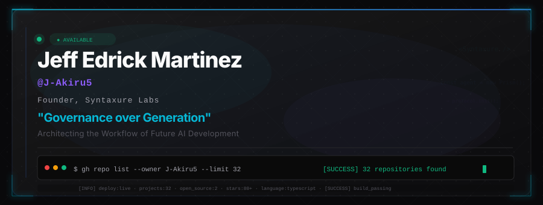
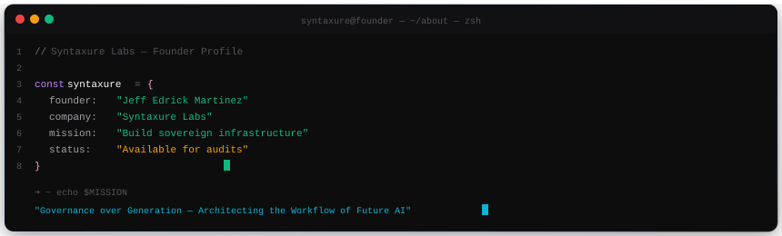

<picture>
  <source media="(prefers-color-scheme: dark)" srcset="./assets/hero-banner.svg">
  
</picture>

  
  
  
  
  

 

---

  

I build production-ready, SEO-optimized web platforms, SaaS products, and AI-native developer tooling — all deployed on free-tier infrastructure leveraging GitHub Student benefits, Cloudflare, and Supabase. Every project ships. Every project is live.

---

### `// Tech Stack`

<table>
<tr>
<td width="25%" valign="top">

#### Languages

</td>
<td width="25%" valign="top">

#### Frontend & Mobile

</td>
<td width="25%" valign="top">

#### Backend & Databases

</td>
<td width="25%" valign="top">

#### Cloud, DevOps & AI

</td>
</tr>
</table>

---

### `// Featured Projects`

<table>
<tr>
<td width="50%" bgcolor="#0C0C0E" valign="top">

<h4>🏢 &nbsp;Syntaxure Labs</h4>

*Enterprise Web Development Studio & Prism SaaS Monorepo*

  
  
  
  

> 8 apps + 5 shared packages — marketing site, Prism Context Engine SaaS, admin dashboards, MCP server, and VS Code extension.

  
  

</td>
<td width="50%" bgcolor="#0C0C0E" valign="top">

<h4>🖥️ &nbsp;Prism Organizer</h4>

*Portable CLI File Management Tool*

  
  
  

⭐ **39 stars** · `v1.2.16` · Open Source

> Smart file scanning, duplicate detection, AI classification, and interactive TUI — published on npm and PyPI.

  
  

</td>
</tr>
<tr>
<td width="50%" bgcolor="#0C0C0E" valign="top">

<h4>🥈 &nbsp;LingsarLoka</h4>

*Village Website — INESCOM 2025 2nd Place*

  
  
  

> Competed at the International Engineering Student Competition 2025 in Indonesia. A web platform for Lingsar Village.

  
  <code>🚧 pending deploy</code>

</td>
<td width="50%" bgcolor="#0C0C0E" valign="top">

<h4>🎬 &nbsp;SineAI Hub</h4>

*AI Filmmakers Ecosystem*

  
  
  

> A centralized ecosystem for the next generation of AI filmmakers — bridging generative AI with cinematic production pipelines.

  

</td>
</tr>
<tr>
<td width="50%" bgcolor="#0C0C0E" valign="top">

<h4>⚡ &nbsp;Energy Monitoring</h4>

*Real-Time IoT Power Tracking*

  
  
  

> PZEM-004T sensor integration with ESP32 · real-time telemetry ingestion · overvoltage, undervoltage & blackout alert detection · configurable PHP/kWh billing engine.

  

</td>
<td width="50%" bgcolor="#0C0C0E" valign="top">

<h4>🏥 &nbsp;E-BHM / Health Triage</h4>

*Barangay Health Management System*

  
  
  

> Electronic Barangay Health Management — medicine inventory & dispensing, AI-powered health chatbot ("Gabby"), and resident triage management for rural health workers.

  
  

</td>
</tr>
</table>

---

### `// Collaborations`

<table>
<tr>
<td width="100%" bgcolor="#0C0C0E" valign="top">

<h4>🔬 &nbsp;ICTIRC — Information & Communication Technology International Research Conference</h4>

  <b>Role: Lead Developer</b> &nbsp;·&nbsp;
  <a href="https://github.com/CICTstudcoDingle/ictirc">CICTstudcoDingle/ictirc</a>

  
  
  
  

> Full-stack research repository & conference management platform — dual hot/cold storage architecture, multi-tier RBAC, paper submission & review workflow, plagiarism detection, QR-based event registration.

  
  

</td>
</tr>
</table>

---

### `// All Repositories`

<b>View all 30+ repositories</b>

 

| Project | Stack | Description |
|---|---|---|
| [LikasLens](https://github.com/J-Akiru5/LikasLens) ⭐40 | JavaScript | Smart community watchdog — earn rewards for reporting environmental issues |
| [CICT Tech Portal](https://github.com/J-Akiru5/cict-tech-portal) | PHP | Department portal for ISUFST CICT Student Council |
| [DAMS](https://github.com/J-Akiru5/dams) | PHP | DSWD Assistance Management System |
| [Gamefowl](https://github.com/J-Akiru5/gamefowl) | TypeScript | Gamefowl management & tracking |
| [CRMS](https://github.com/J-Akiru5/crms-project) | — | Campus Resource Management System for ISUFST |
| [Scheduler](https://github.com/J-Akiru5/scheduler) | TypeScript | BSIT course schedule management |
| [keandrew-photography](https://github.com/J-Akiru5/keandrew-photography) | TypeScript | Official photography portfolio website |
| [GSUS Hackathon](https://github.com/J-Akiru5/GSUS-Hackathon-Project) | JavaScript | Hackathon project submission |
| [Attendance Tracker](https://github.com/J-Akiru5/attendance-tracker-app) | JavaScript | Attendance tracking application |
| [Online Exam System](https://github.com/J-Akiru5/online-examination-system) | PHP | Online examination platform |
| [Feed Inventory](https://github.com/J-Akiru5/feed-inventory-tracker) | PHP | Feed inventory tracking system |
| [CICT Grade Portal](https://github.com/J-Akiru5/cict-grade-portal) | Python | Grade management portal |
| [My Portfolio](https://github.com/J-Akiru5/my-portfolio-react) | React + Vite | Personal developer portfolio |
| [Capstone Portal](https://github.com/J-Akiru5/capstone-portal-cict) | TypeScript | Capstone project management for CICT |

  <a href="https://github.com/J-Akiru5?tab=repositories"><b>Browse all 32 repositories →</b></a>

---

### `// GitHub Analytics`

  <picture>
    <source media="(prefers-color-scheme: dark)" srcset="https://github-readme-stats.vercel.app/api?username=J-Akiru5&show_icons=true&hide_border=true&bg_color=09090B&title_color=3B82F6&icon_color=10B981&text_color=A1A1AA&ring_color=06B6D4&rank_icon=github&custom_title=GitHub%20Stats">
    
  </picture>
  <picture>
    <source media="(prefers-color-scheme: dark)" srcset="https://github-readme-stats.vercel.app/api/top-langs/?username=J-Akiru5&layout=compact&hide_border=true&bg_color=09090B&title_color=3B82F6&text_color=A1A1AA&hide=blade,html,css&langs_count=8">
    
  </picture>

  

  

---

### `// Achievements`

<table>
<tr>
<td width="33%" bgcolor="#0C0C0E" align="center">

### 🥈

**INESCOM 2025**

2nd Place

*International Engineering Student Competition*

LingsarLoka — Indonesia

</td>
<td width="33%" bgcolor="#0C0C0E" align="center">

### ⭐

**80+ Stars**

Open Source Impact

*LikasLens + Prism Organizer*

Combined community traction

</td>
<td width="33%" bgcolor="#0C0C0E" align="center">

### 🏆

**5 GitHub Badges**

Achievements

*Starstruck · Quickdraw · YOLO*

Pair Extraordinaire · Pull Shark

</td>
</tr>
</table>

---

### `// Start Project`

 

&nbsp;

&nbsp;

  

<picture>
  <source media="(prefers-color-scheme: dark)" srcset="https://raw.githubusercontent.com/J-Akiru5/J-Akiru5/main/assets/divider.svg">
  
</picture>

 

  

> `"Governance over Generation"` — Syntaxure Labs Manifesto

© 2026 Syntaxure Labs · BS Information Technology — ISUFST-Dingle Campus

